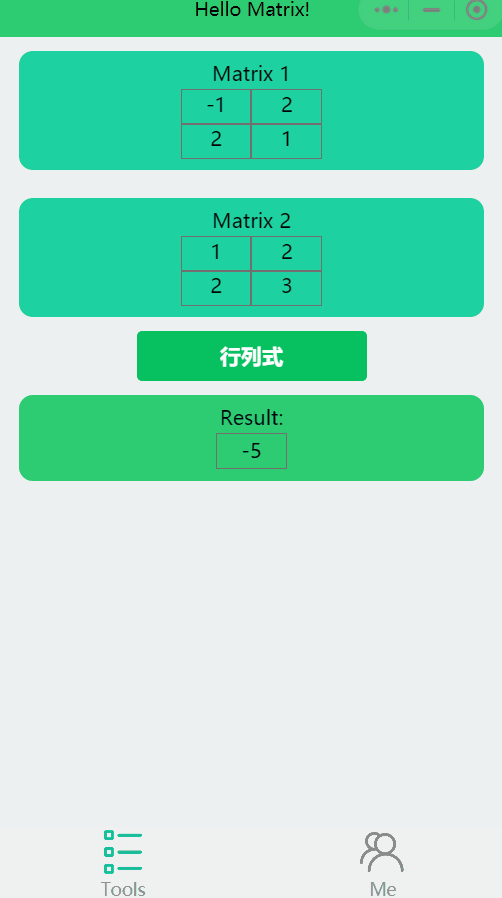
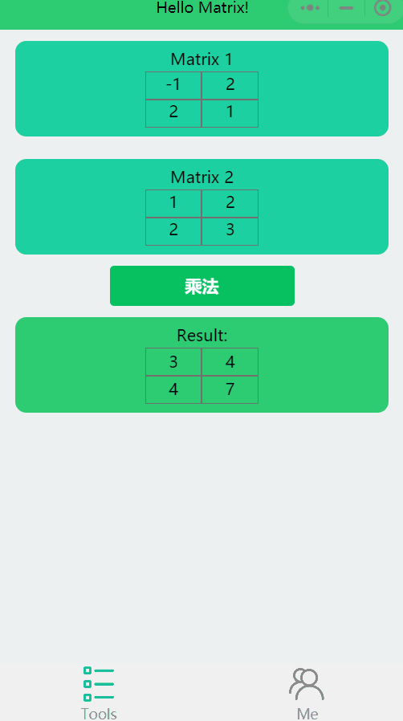
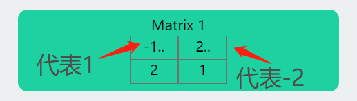
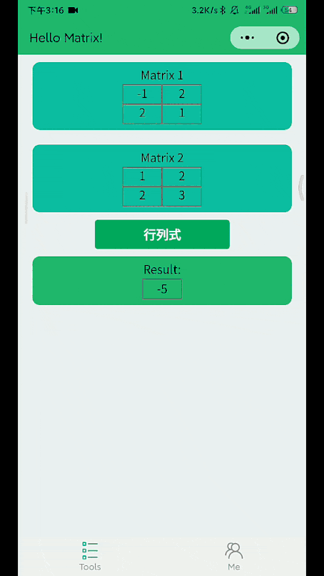

# Introduction

:smile: 欢迎你来！这里是 *HelloMatrix* 的介绍文档！

[:heavy_exclamation_mark: 看不到图片的话请点这里](https://gitee.com/Zero-Pointer/HelloMatrixUserGuide)

此文档中会逐一介绍以下功能，并且会在将来继续更新:muscle:：

* 矩阵的换位操作
* 单矩阵输入的计算
* :star: 矩阵计算模式的切换
* :star: 矩阵的复制&粘贴
* :star: 负数的输入

---

---

## 矩阵的换位操作

:question:：怎么切换矩阵的顺序？

* 左滑目标矩阵
  
* 点击 *上* 或 *下* 图标即可
  

---

## 单矩阵输入的计算

:question:：对于行列式、逆等，只需要一个矩阵作为参数的计算，当前界面有许多矩阵，会算哪一个呢

* 第一个哦

---

## 矩阵计算模式的切换

:question:：我想换计算模式，应该怎么换呢

* 长按计算按钮即可！
  

---

## 矩阵的复制&粘贴

:question:：我想复制某个矩阵可以吗？

* 长按某个矩阵
* 左滑所在加入位置的矩阵
* 点击加号
* 弹窗中直接选粘贴
  

---

## 负数的输入

:question:：我怎么才能在矩阵里输入负数呢？

*内心独白：微信小程序没有提供带负号的键盘并且如果用猴急输入法输入又要每次都切到数字模式我们觉得这样反而更麻烦于是用了一种奇奇怪怪的办法希望大家用的愉快！*

* 如果想输入负数，在改数字的后面输入两个小数点
  
* 下拉刷新！
  

---

---

# Contact us

邮箱 :email: ``ptmatrix@126.com``

微信公众号：``SoulDa``

---

---

# Question

* :satisfied: ​如果有想法和建议，欢迎大家发邮件、公众号私信、提 issue 给我们！
* :heart: 使用愉快！